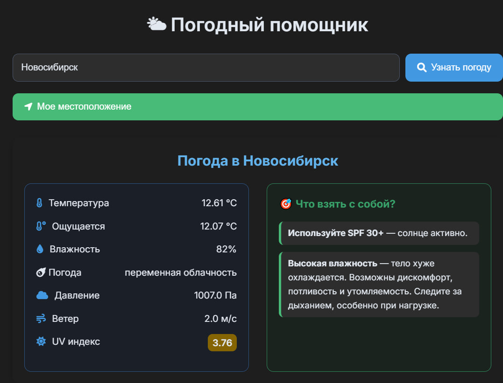
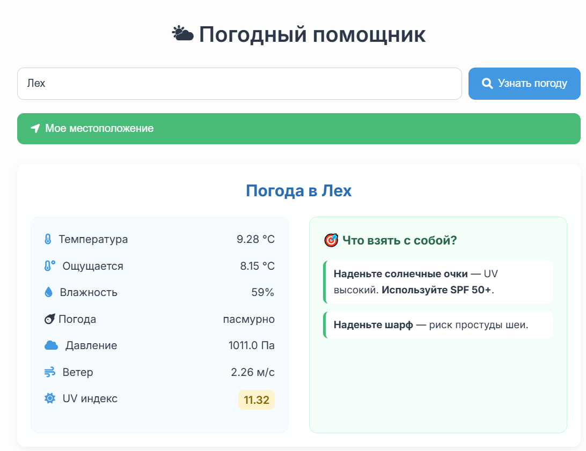

# WeatherHint — подсказки, что взять по погоде
Показывает погоду, даёт рекомендации, что взять в текущих условий.

### Что я освоила в этом проекте:

Показывает погоду по названию города

Определяет город по вашим координатам (геолокация)

Учитывает температуру, UV-индекс и погодные условия для рекомендаций

Стек: Java 23, Spring Boot, REST API, Thymeleaf, Maven.